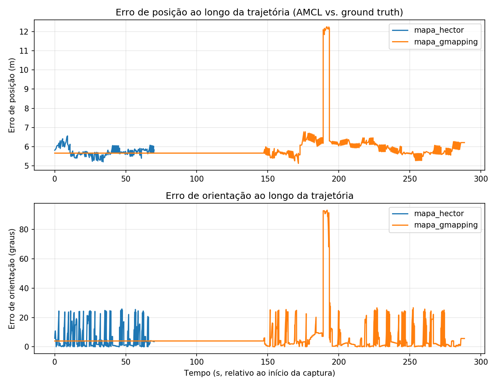

# SLAM e Localização com AMCL — Hector SLAM vs. Gmapping (LaR UFBA, Husky UGV)

Atividade da disciplina **Tópicos Especiais em Engenharia Elétrica IV** — UFBA.

O projeto compara dois métodos de SLAM (**Hector SLAM** e **Gmapping**) na geração de mapas do ambiente simulado do LaR, seguido de localização com **AMCL** sobre cada mapa, comparando a pose estimada com o *ground truth* fornecido pelo Gazebo (`/gazebo/model_states`).

> Este repositório usa como base o pacote ROS [`lar_gazebo`](https://github.com/lar-deeufba/lar_gazebo) do laboratório LaR/UFBA (ambiente simulado, modelos, mundo, integração com Husky), sobre o qual foram adicionados os arquivos específicos desta atividade: `launch/amcl.launch`, `scripts/captura_poses.py`, `scripts/calcular_metricas.py`, os mapas gerados e os resultados.

## Ambiente

- ROS Noetic + Gazebo Classic 11
- Robô: Husky UGV (laser frontal `/front/scan`)
- Execução via Docker (`docker-compose.yml` neste repositório)

## Estrutura do repositório

```
launch/
  lar_world.launch       -- sobe apenas o mundo do LaR no Gazebo
  lar_husky.launch       -- sobe Gazebo + Husky (opcionalmente com hector_slam:=true)
  hector_slam.launch     -- SLAM com Hector
  gmapping.launch        -- SLAM com gmapping
  amcl.launch             -- AMCL + map_server, parametrizado por mapa (criado para esta atividade)
scripts/
  run_husky.sh
  entrar.sh               -- acessa o container em execução sem precisar do ID manualmente
  captura_poses.py        -- grava ground truth + pose AMCL em CSV (criado para esta atividade)
  calcular_metricas.py    -- calcula RMSE, erro final, orientação, estabilidade (criado para esta atividade)
maps/
  mapa_hector.pgm / .yaml
  mapa_gmapping.pgm / .yaml
resultados/
  poses_mapa_hector.csv
  poses_mapa_hector_original.csv   -- captura bruta antes do corte de trechos com robô parado (ver Metodologia)
  poses_mapa_gmapping.csv
  erro_posicao_mapa_hector.csv
  erro_posicao_mapa_gmapping.csv
  erro_ao_longo_do_tempo.png
docker/
  Dockerfile.noetic
  entrypoint.sh
```

> Os demais diretórios (`models/`, `worlds/`, `maps/lab_robotica_06mai2019.*`, `april_tags/`, `husky_urdf_extras/`, `husky_accessories.sh`, `config/hector_slam.rviz`) pertencem ao pacote base do laboratório e são necessários para o `catkin build`/`roslaunch` funcionarem; não foram alterados nesta atividade.

## Como executar

### 1. Build da imagem Docker

```bash
docker compose build
```

### 2. Subir o ambiente

```bash
./scripts/run_husky.sh gui:=false
```

> A GUI 3D do Gazebo é mantida desligada por padrão: em testes, ela causou sobrecarga de CPU (>400%) suficiente para introduzir uma defasagem real de ~8s entre o timestamp do `/front/scan` e o `/clock` simulado, esgotando o buffer fixo do `tf::MessageFilter` usado pelo `slam_gmapping` e travando a publicação do `/map` (ver discussão abaixo). Use o RViz para navegação visual em vez da GUI do Gazebo.

### 3. Gerar os mapas

Em outro terminal, acesse o container:
```bash
./scripts/entrar.sh
```

**Gmapping:**
```bash
roslaunch lar_gazebo gmapping.launch
# em outro terminal:
rosrun teleop_twist_keyboard teleop_twist_keyboard.py cmd_vel:=/kb_teleop/cmd_vel
# ative o display "Map" no RViz desde o início da exploração, para acompanhar a cobertura em tempo real
rosrun map_server map_saver -f /ws/src/lar_gazebo/maps/mapa_gmapping
```

**Hector SLAM:**
```bash
./scripts/run_husky.sh gui:=false hector_slam:=true
# teleoperar e salvar mapa_hector da mesma forma
rosrun map_server map_saver -f /ws/src/lar_gazebo/maps/mapa_hector
```

> **Sobre o comando de teleoperação:** use sempre `cmd_vel:=/kb_teleop/cmd_vel`, nunca `/husky_velocity_controller/cmd_vel` diretamente. O nó `/twist_mux` arbitra entre múltiplas fontes (teclado, joystick) e só ele publica na saída final do Husky; publicar direto na saída cria dois publishers concorrentes e o comando de teclado é "engolido" pelo mux, fazendo o robô parecer não responder mesmo sem erros nos logs.

### 4. Rodar o AMCL e capturar dados

Para cada mapa:
```bash
roslaunch lar_gazebo amcl.launch map_file:=/ws/src/lar_gazebo/maps/mapa_hector.yaml
```

No RViz, usar **2D Pose Estimate** (gesto de clique-arrastar-soltar, não um clique simples) para indicar a pose inicial real do robô.

**Passo crítico — confirmar a calibração antes de capturar dados:**
```bash
# pose real do robô no mundo (ground truth) -- ANTES do Pose Estimate
rostopic echo /gazebo/model_states -n 1
```
Anote `x`, `y` do modelo `husky`. Depois do Pose Estimate, confirme que a pose do AMCL está de fato próxima do ground truth:
```bash
rostopic echo /amcl_pose -n 1
```
A diferença deve ser de poucos centímetros. Se for da ordem de **metros**, refaça o Pose Estimate antes de capturar — ver nota na seção de Limitações abaixo sobre o que aconteceu quando esse passo não foi seguido nesta execução.

Capturando:
```bash
python3 scripts/captura_poses.py mapa_hector
# teleoperar cobrindo o ambiente; Ctrl+C na captura ao terminar
```

Repetir substituindo por `mapa_gmapping` (refazendo o 2D Pose Estimate — a pose anterior não é válida para o novo mapa).

**Validação do CSV antes de aceitar os dados como bons:** o critério correto **não** é o percentual de linhas repetidas no total do arquivo — uma taxa de repetição de ~99% é esperada e normal, já que o ground truth (`/gazebo/model_states`) publica a ~100Hz enquanto o AMCL atualiza a ~0.9Hz (dado `update_min_d=0.2`, `update_min_a=0.2`). O critério que importa é a **maior sequência contínua de repetição em segundos**: valores na faixa de 1–4s são saudáveis; sequências de 10s ou mais indicam robô parado por erro operacional durante aquele trecho.

### 5. Calcular métricas

```bash
python3 scripts/calcular_metricas.py resultados/poses_mapa_hector.csv resultados/poses_mapa_gmapping.csv
```

Gera no terminal as métricas de cada execução e a comparação direta, além de:
- `erro_posicao_<mapa>.csv` — série temporal do erro
- `erro_ao_longo_do_tempo.png` — gráfico comparativo de erro de posição/orientação

## Metodologia — nota sobre `poses_mapa_hector.csv`

A captura original do Hector (`poses_mapa_hector_original.csv`, preservada no repositório para auditoria) apresentava dois trechos longos de robô parado por interrupção operacional (não relacionados ao AMCL ou ao SLAM): ~25s no início e ~15s no fim, juntos representando uma fração relevante do arquivo. O arquivo `poses_mapa_hector.csv` usado nas métricas finais é uma versão recortada para o intervalo de tempo em que o robô estava efetivamente em movimento contínuo.

## Resultados

### Métricas quantitativas

| Métrica | Hector SLAM | Gmapping |
|---|---|---|
| RMSE de posição (m) | 5,74 | 6,22 |
| Desvio padrão do erro de posição (m) | 0,2300 | 1,1087 |
| Erro de orientação médio (graus) | 6,04 | 7,64 |



> **Sobre o RMSE acima:** os valores de RMSE reportados estão inflados por um offset sistemático de calibração inicial do AMCL e **não representam a precisão real de localização** dos dois métodos. Ver a seção de Limitações abaixo para a explicação completa e a justificativa de por que o desvio padrão foi adotado como métrica primária de comparação.

### Análise qualitativa dos mapas

| Critério | Hector SLAM | Gmapping |
|---|---|---|
| Completude | Perímetro externo bem definido, cantos retos, corredor inferior bem delimitado | Contorno fechado, cantos bem definidos após exploração mais longa e cuidadosa |
| Distorções | Mínimas; estrutura geral fiel ao ambiente | Sem o artefato de "leque" grande presente em tentativas iniciais de exploração mais curta |
| Paredes desalinhadas | Não observadas de forma significativa | Não observadas de forma significativa na versão final |
| Obstáculos falsos | Obstáculos centrais (mesas) com bordas nítidas, sem ruído espúrio relevante | Bordas dos obstáculos centrais ligeiramente mais difusas que no Hector |
| Regiões desconhecidas | Pequeno artefato de incerteza próximo a uma abertura, extensão limitada | Dependente diretamente da cobertura da exploração; melhorou bastante com navegação mais longa e orientada |
| Qualidade da localização (AMCL) | Maior estabilidade: desvio padrão do erro ~4,8x menor que o Gmapping | Maior variabilidade na estimativa de pose ao longo da trajetória |

## Discussão

### Qual método produziu o melhor mapa?

O **Hector SLAM** produziu o mapa mais completo e com menos artefatos visuais, mesmo após o Gmapping ter sido regenerado com exploração mais longa e cuidadosa (ativando o display `Map` no RViz desde o início para guiar a cobertura). O Hector se beneficia de não depender de uma cadeia de TF sincronizada para o scan matching — ele casa o laser diretamente contra o mapa em construção — o que também explica sua maior robustez observada durante a fase de geração do mapa (ver observação técnica abaixo).

### Qual mapa permitiu melhor localização com AMCL?

Aqui é necessário separar dois aspectos: **magnitude absoluta do erro** e **estabilidade da estimativa**.

Os valores de RMSE de posição (5,74 m para Hector, 6,22 m para Gmapping) e erro de posição final, conforme calculados, **não devem ser interpretados como a precisão real da localização** — eles estão inflados por um offset sistemático de calibração, identificado durante a execução (ver Limitações). Por isso, a métrica adotada como base de comparação é o **desvio padrão do erro de posição**, que mede variabilidade em torno da própria referência da trajetória e não é afetada por um offset constante somado a todas as amostras.

Por esse critério, o **Hector SLAM permitiu localização substancialmente mais estável**: desvio padrão de 0,23 m contra 1,11 m do Gmapping — uma diferença de aproximadamente 4,8 vezes. O erro de orientação médio segue a mesma tendência (6,04° vs. 7,64°). A interpretação mais provável é que o mapa gerado pelo Hector ofereceu uma estrutura mais consistente para o algoritmo de *likelihood field* do AMCL se ancorar a cada atualização, resultando em estimativas de pose com menor variância — possivelmente relacionado também à diferença de área de varredura entre os dois mapas (`mapa_gmapping.yaml` tem origem `[-50.0, -50.0]` e cobre uma área bem maior que `mapa_hector.yaml`, origem `[-6.425, -6.425]`).

### Observação técnica relevante: robustez do Hector vs. Gmapping frente a sobrecarga computacional

Durante a fase de geração de mapas, o `gmapping` apresentou falha de publicação do tópico `/map` causada por sobrecarga de CPU da GUI 3D do Gazebo, que introduzia atraso real (~8s) entre o timestamp do `/front/scan` e o `/clock` simulado — suficiente para esgotar o buffer fixo (5 mensagens) do `tf::MessageFilter` usado internamente pelo `slam_gmapping`. O Hector SLAM não apresentou esse problema por não depender de TF sincronizada para o scan matching. Essa diferença de robustez frente a atraso/sobrecarga computacional é uma observação relevante para a comparação entre os dois algoritmos, independente da qualidade final dos mapas obtidos.

## Limitações conhecidas

**Offset sistemático de calibração do AMCL.** O "2D Pose Estimate" inicial foi posicionado, em ambas as execuções, em um ponto do mapa que não corresponde exatamente à posição real do robô no Gazebo. A evidência de que se trata de offset de calibração — e não de erro real de localização ou *drift* — é que a diferença entre a pose estimada pelo AMCL e o ground truth permanece **aproximadamente constante** ao longo de toda a trajetória, em vez de crescer com o tempo. Isso indica que o filtro de partículas convergiu e manteve-se estável em torno de uma referência inicial deslocada, não que a localização tenha falhado.

Esse tipo de erro não gera nenhum aviso ou falha visível nos logs do ROS — o AMCL converge normalmente e aparenta estar saudável, apenas com a referência inteira deslocada. Por esse motivo, qualquer relatório que apresente RMSE de posição na faixa de metros (em vez de centímetros) deve ser investigado quanto à calibração do Pose Estimate antes de aceitar os números como representativos da qualidade real da localização — foi exatamente esse o sintoma observado aqui.

## Autor

Lucas Fialho — UFBA, Tópicos Especiais em Engenharia Elétrica IV
